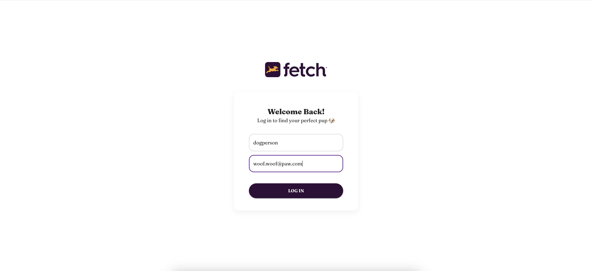
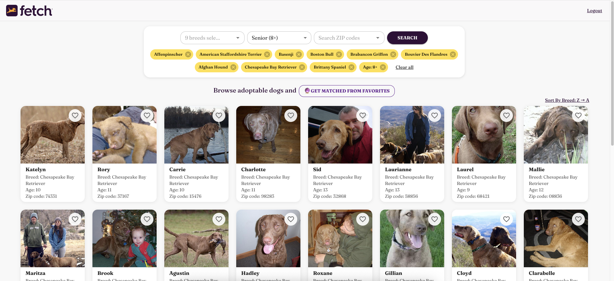
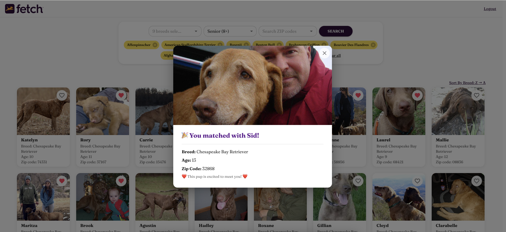
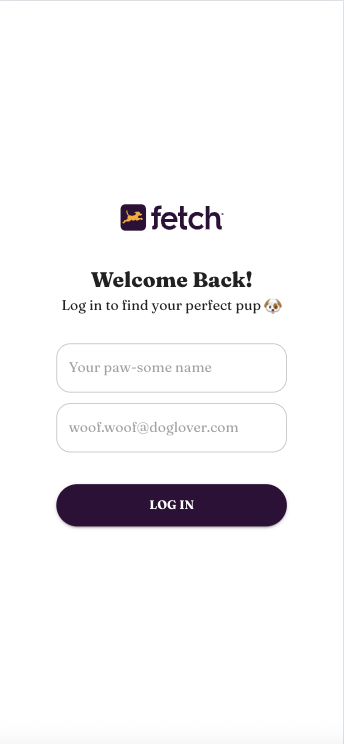
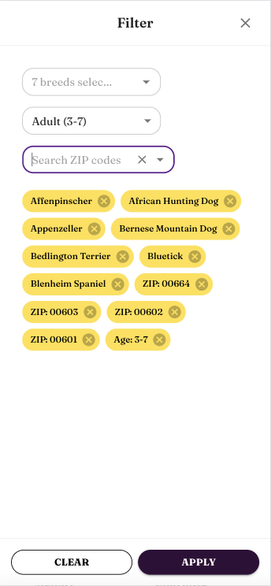
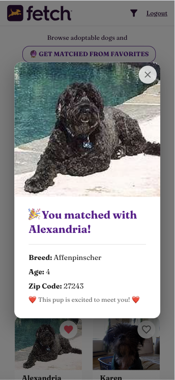

# 🐶 Fetch Dog Matcher

An adorable React app where users can log in, browse adoptable dogs, filter by breed, zip code, or age, and get matched with their perfect pup — powered by Fetch's take-home API and deployed on AWS.

---

## 🔗 Live Site

👉 Deploy via AWS S3 [http://fetch-frontend-yating-yang.s3-website-us-west-2.amazonaws.com/](http://fetch-frontend-yating-yang.s3-website-us-west-2.amazonaws.com/)

👉 Deploy via CloudFront [https://d1m96gqp7t0yzz.cloudfront.net](https://d1m96gqp7t0yzz.cloudfront.net)

> 📱 Works best on **Chrome** and **Firefox**. Safari may block login due to cookie restrictions.

---

## ✨ Features

- 🔐 Login with name & email (session-based authentication)
- 🐕 Search adoptable dogs with filters:
  - Filter by breed, age range, and ZIP code
  - Multi-select support for breed & ZIP
- 📋 Sort alphabetically (A→Z / Z→A)
- 📄 Paginate search results
- ❤️ Favorite your preferred dogs
- 🔮 Click "Get Match" to receive one best-fit dog
- 📱 Responsive UI for desktop and mobile

---

## 📸 Screenshots

> Screenshots are located in the `./screenshots/` folder.

### 🖥️ Desktop

#### 🔐 Login Page  


#### 🐶 Dog Search + Filters  


#### 🔮 Match Result  


---

### 📱 Mobile

#### 🔐 Login Page  


#### 🐶 Dog Search + Filters  


#### 🔮 Match Result  


---

## 🚀 Tech Stack

| Tech              | Purpose                                   |
|------------------|-------------------------------------------|
| React + MUI      | UI and layout components                  |
| React Router     | Route management                          |
| Axios            | API communication                         |
| AWS S3           | Static file hosting                       |
| AWS CloudFront   | CDN delivery + HTTPS                      |
| Fetch API        | `/auth/login`, `/dogs/search`, `/dogs/match` |

---

## 🛠 Local Setup

```bash
git clone https://github.com/your-username/fetch-dog-matcher.git
cd fetch-dog-matcher
npm install
npm start
